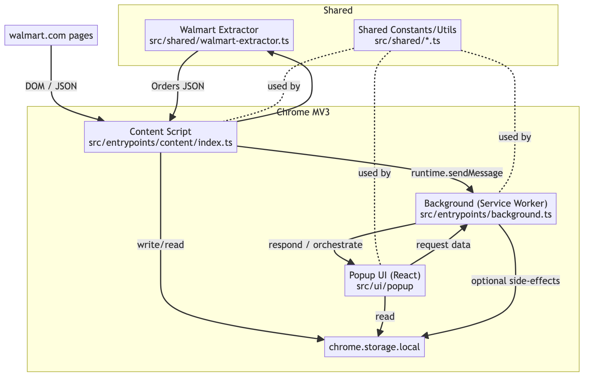
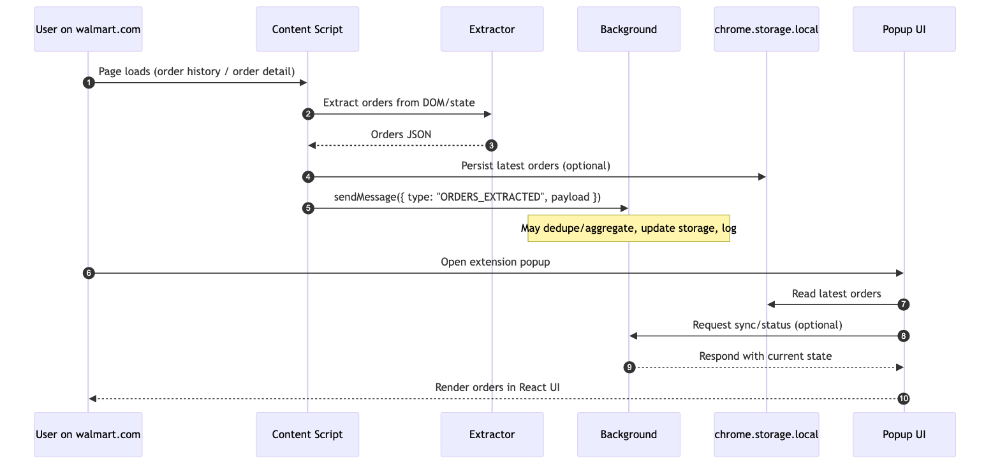

## Architecture

This extension is built with WXT (MV3) + Vite + React. It has three runtime pieces:

- Content script that runs on walmart.com pages and extracts order data.
- Background service worker that coordinates messaging, optional persistence, and side-effects.
- Popup UI (React) that reads data and displays it to the user.

### Typical flow

### Notes

- The extractor is defensive: it can parse DOM or page state when available.
- Shared modules provide constants, patterns, and helpers for both content and popup.
- Storage is optional; the popup can also request fresh data from the background.
- Build output is generated by WXT under `.wxt/chrome-mv3`.
